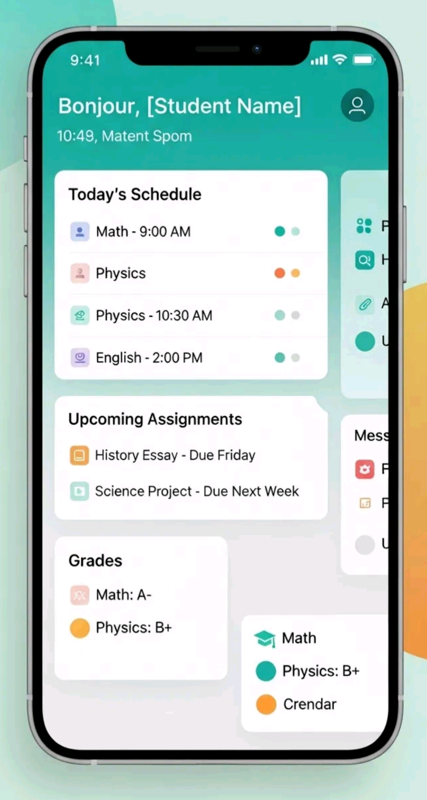
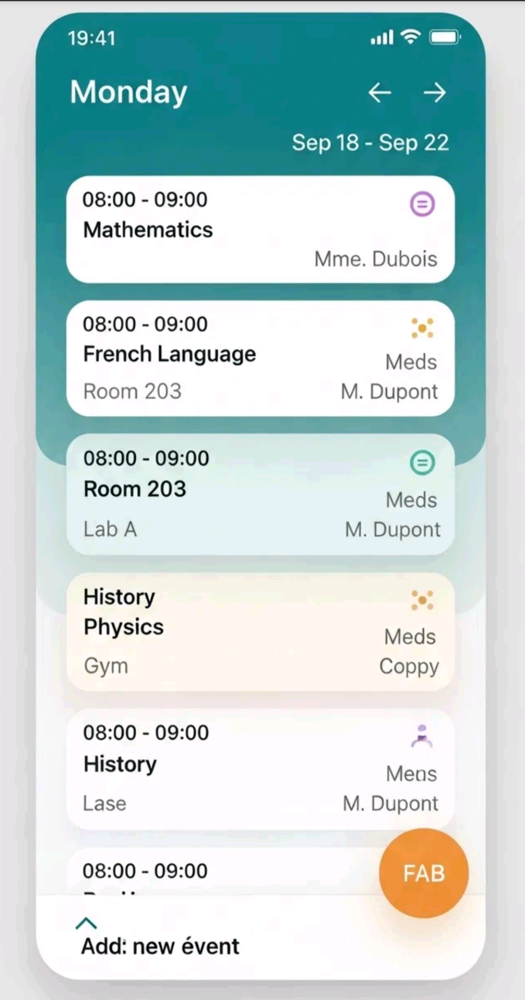
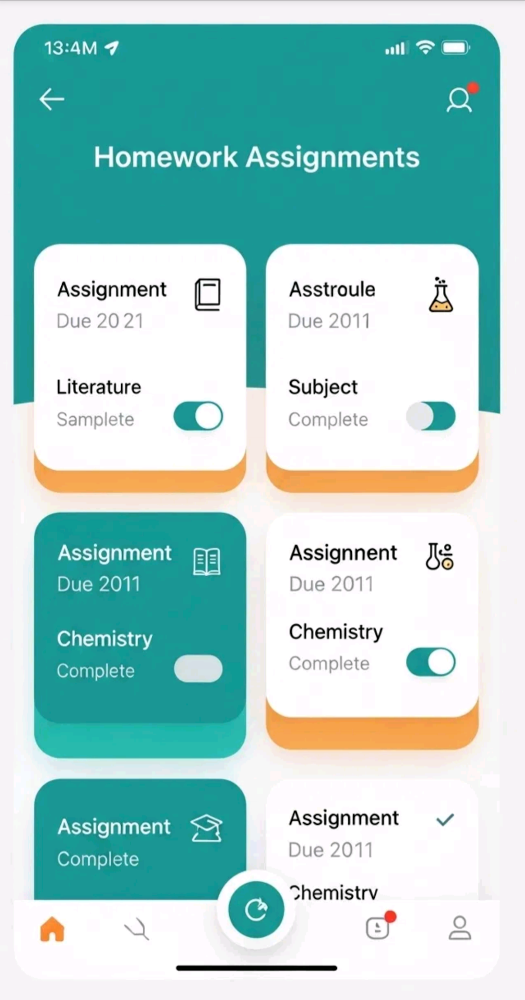
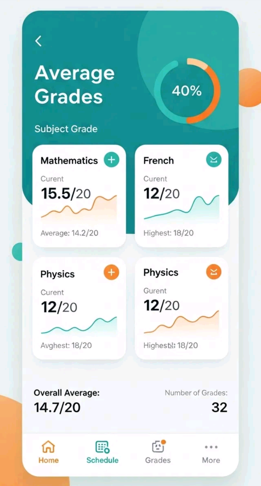

# Pronote Redesign: Reimagining the educational experience with Material You 3 Expressive

## 🚀 Project Vision

This project's vision is to transform Pronote from a purely functional tool into an engaging educational companion that delights users while maintaining all core functionality.

---

## 🧐 Problem Analysis

While the current Pronote application is comprehensive and functional, it has several areas for improvement.

| Strength | Area for Improvement (Priority) |
| :--- | :--- |
| ✅ **Comprehensive & Functional** | 🎨 **Visual Appeal** (High): The design is dated and has limited use of modern UI patterns. |
| | 🤔 **User Experience** (Medium): There is limited visual hierarchy and information organization. |
| | ❤️ **Engagement** (Medium): The app lacks emotional connection and personalization. |

---

## ✨ Design Direction & Principles

The redesign is guided by the core principles of Material You 3 Expressive, focusing on creating a more adaptive, and expressive interface.

### Key Transformation Areas
* From rigid layouts to organic, flowing designs.
* From flat colors to dynamic, adaptive palettes.
* From basic interactions to delightful micro-animations.
* From a generic UI to personalized experiences.

### Color & Typography
The design system uses a primary palette of Teal and a secondary palette of Amber as the default theme for brand consistency. It leverages Material You's dynamic color system to adapt to user wallpapers
